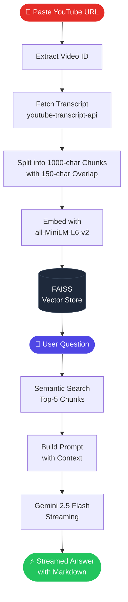

<div align="center">


[](https://git.io/typing-svg)

<br/>

[](https://python.org)
[](https://flask.palletsprojects.com)
[](https://ai.google.dev)
[](https://langchain.com)
[](https://render.com)

</div>

---

## What is Tube Lens?

**Tube Lens** is a RAG-powered chatbot that lets you have a conversation with any YouTube video. Paste a URL, and start asking questions — the app fetches the transcript, builds a semantic search index on the fly, and streams accurate, markdown-formatted answers using Google Gemini.

No more scrubbing through hour-long videos to find one answer.

---

## Features

- **Any video, any language** — auto-detects available transcript language, prefers English but falls back gracefully to Hindi, Spanish, and more
- **Streaming answers** — tokens stream to the UI in real time, no waiting for the full response
- **Markdown rendering** — bold terms, bullet lists, headers, and inline code all render cleanly
- **Session-isolated** — each browser tab gets its own FAISS vector store, no cross-user leakage
- **Smart retrieval** — top-5 semantically similar chunks are retrieved per question for accurate, grounded answers
- **Change video on the fly** — swap to a different video without refreshing the page

---

## How It Works



---

## Tech Stack

| Layer | Technology |
|-------|-----------|
| LLM | Google Gemini 2.5 Flash |
| Orchestration | LangChain |
| Embeddings | `sentence-transformers/all-MiniLM-L6-v2` (HuggingFace) |
| Vector Store | FAISS (in-memory) |
| Transcript | `youtube-transcript-api` |
| Backend | Flask + Gunicorn |
| Frontend | Vanilla JS · marked.js · CSS3 |
| Deployment | Render |

---

## Getting Started

### Prerequisites

- Python 3.10+
- A [Google AI Studio](https://aistudio.google.com/app/apikey) API key (free)

### Local Setup

```bash
# 1. Clone the repo
git clone https://github.com/YOUR_USERNAME/tube-lens.git
cd tube-lens

# 2. Create and activate a virtual environment
python -m venv venv
source venv/bin/activate      # Windows: venv\Scripts\activate

# 3. Install dependencies
pip install -r requirements.txt

# 4. Add your API key
echo "GOOGLE_API_KEY=your_key_here" > .env

# 5. Run
python youtube_chatbot.py
```

Open **http://localhost:5002** in your browser.

---

## Deploy to Render

> One-click deploy using the included `render.yaml`.

1. Push this repo to GitHub
2. Go to [render.com](https://render.com) → **New → Web Service**
3. Connect your GitHub repo — Render auto-detects `render.yaml`
4. In **Environment**, add:
   ```
   GOOGLE_API_KEY = <your Google AI Studio key>
   ```
   (`SECRET_KEY` is auto-generated by Render from `render.yaml`)
5. Click **Deploy** — done in ~3 minutes

> **Free tier note:** The service sleeps after 15 min of inactivity. First request on a cold start takes ~10 s while the embedding model loads. Subsequent requests are fast.

---

## Usage

### Getting a video ID

```
Full URL  →  https://www.youtube.com/watch?v=dQw4w9WgXcQ
Short URL →  https://youtu.be/dQw4w9WgXcQ
Video ID  →  dQw4w9WgXcQ          ← the 11 characters after v=
```

All three formats work — paste any of them into the input box.

> The video must have **captions (CC) enabled**. Auto-generated captions count.

### Example questions to try

- *"Summarize the key points of this video"*
- *"What does the speaker say about X?"*
- *"List the steps mentioned for doing Y"*
- *"What examples are given to explain Z?"*

---

## Project Structure

```
tube-lens/
├── youtube_chatbot.py   # Flask app — routes, RAG pipeline, streaming
├── templates/
│   └── youtube.html     # Single-page UI with streaming chat
├── requirements.txt     # All Python dependencies
├── Procfile             # Gunicorn start command for Render
├── render.yaml          # Render deployment configuration
└── .gitignore
```

---

## Environment Variables

| Variable | Required | Description |
|----------|----------|-------------|
| `GOOGLE_API_KEY` | Yes | Google AI Studio key for Gemini |
| `SECRET_KEY` | Recommended | Flask session secret — auto-generated by Render |
| `PORT` | No | Server port (default: 5002 for local, injected by Render) |

---

<div align="center">


**Built with LangChain · Gemini · Flask**

</div>
